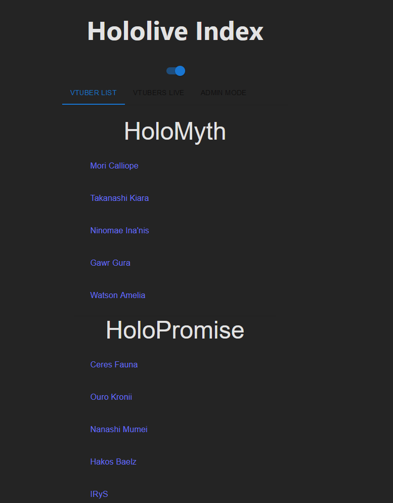
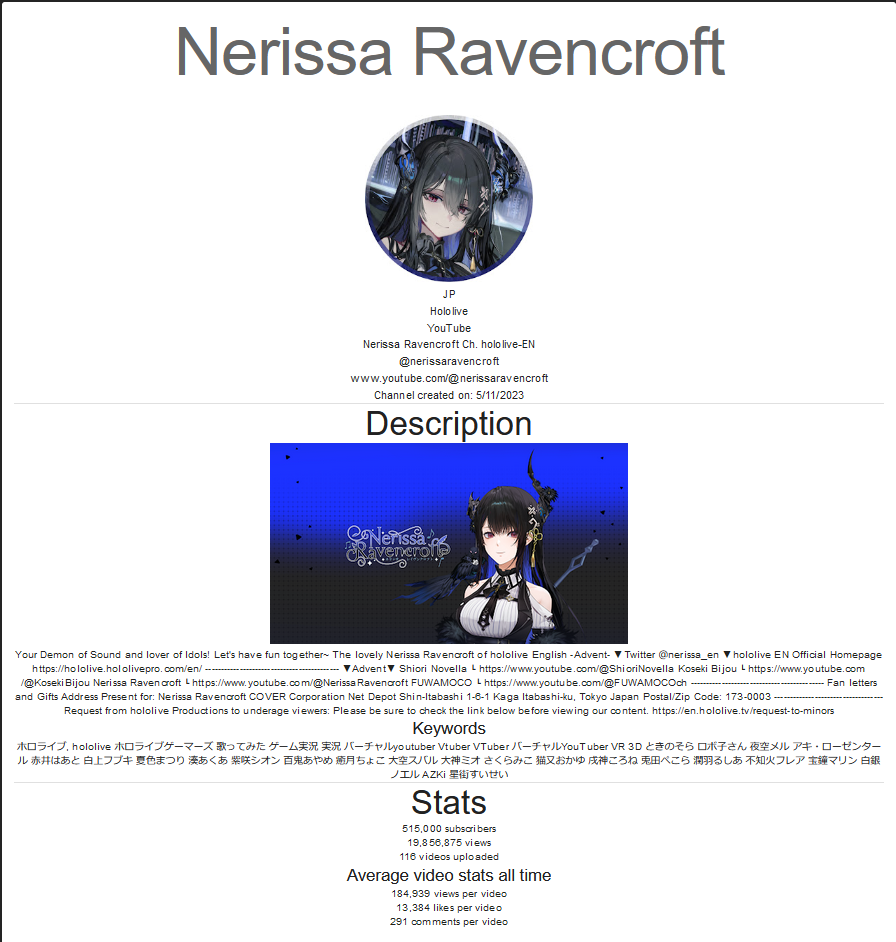
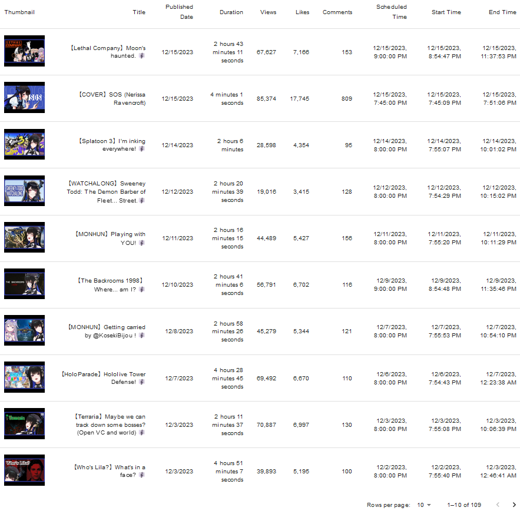
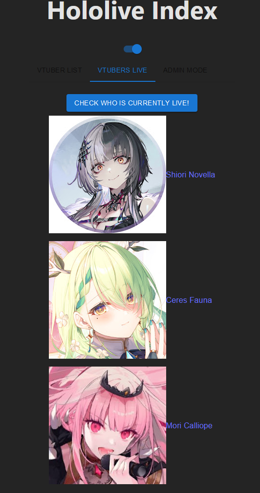
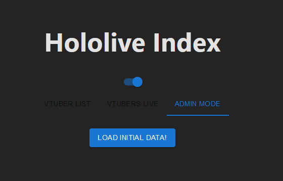

# Hololive Index (React Typescript)

## Description
An application where you can browse Hololive English members, look up their channel status, view their video catelog and check which members are currently live.

## Features
- Users can view Hololive English members and see their channel infomation, stats, and past videos.
- Users can check who which Hololive English members are currently livestreaming

## How to Run the Files
```
git clone project

cd backend
npm install
npm start

cd frontend
npm install
npm run dev 
```

## Note
You'll need to create your own instance of MongoDB and an API key for YouTube Data v3 API. I've removed those from the code!

## Technologies
- React
- Material UI
- React Router
- Typescript
- MongoDB
- Mongoose
- YouTube Data API v3

## Pictures




